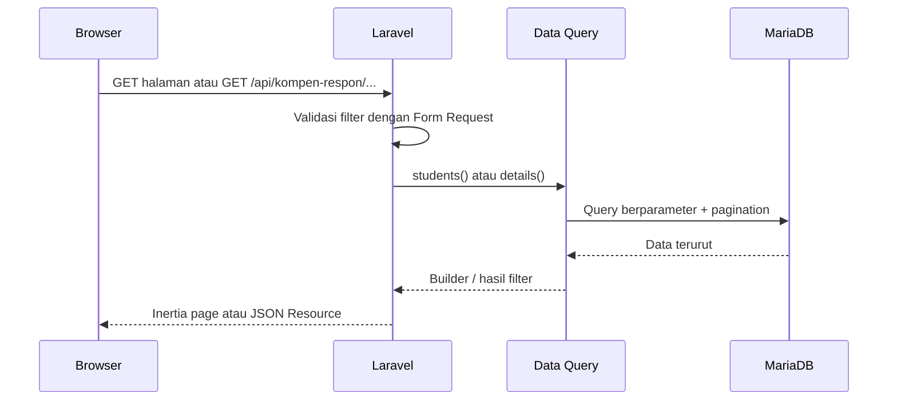

# Backend Sikompen

## Peran sistem

Sikompen adalah aplikasi Laravel yang memisahkan dua akses:

- **Mahasiswa:** publik dan hanya-baca. Dapat melihat tabel, memakai filter, membuka data lengkap seorang mahasiswa melalui API, lalu mengunduh XLSX/PDF sesuai periode.
- **Admin:** memakai session guard `admin`. Admin dapat mengunggah workbook, memantau proses impor, mengunduh workbook yang pernah masuk, melihat audit log, rollback unggahan terakhir, dan membuka pendaftaran admin sementara.

Tidak ada tabel atau guard Laravel `users` bawaan yang dipakai untuk kebutuhan aplikasi. Identitas admin berada di `sikompen_admins`.

## Alur request data



`KompenResponHubDataQuery` menjadi satu sumber query untuk halaman, API, dan ekspor. Dengan begitu perilaku filter tetap sama di semua tempat.

## Alur impor workbook

```mermaid
sequenceDiagram
    participant Admin
    participant Web as Laravel Web
    participant Volume as Storage private
    participant Queue as Database Queue
    participant Worker as Queue Worker
    participant DB as MariaDB

    Admin->>Web: POST workbook + nama pengunggah
    Web->>Web: Validasi XLSX dan ukuran maksimum 20 MB
    Web->>Volume: Simpan XLSX private
    Web->>DB: Buat import task: queued, 0%
    Web->>Queue: Dispatch ProcessKompenResponHubImport
    Web-->>Admin: Kembali ke panel; UI polling status
    Queue->>Worker: Jalankan job
    Worker->>Volume: Baca workbook
    Worker->>Worker: Parse dan validasi template
    Worker->>DB: Transaksi: impor, mahasiswa, detail, audit log
    Worker->>DB: Update task: completed, 100%
    Admin->>Web: GET status task berkala
    Web-->>Admin: Persentase dan pesan progres
```

Pekerjaan impor berjalan di queue, jadi tetap berlangsung ketika admin berpindah tab tabel. Batas PHP, Nginx FastCGI, dan worker adalah 600 detik untuk mengakomodasi koneksi server yang lambat.

### Aturan impor

1. Workbook harus memakai sheet `Kompen dan Respon` dan `Detail Kompen` dari template.
2. Parser menemukan blok kelas melalui marker dan membaca metadata periode, kelas, dan tingkat dari sel template.
3. Periode semua blok kelas harus sama; NIM harus valid dan tidak boleh duplikat dalam kelas yang sama.
4. Detail harus menunjuk ke kombinasi kelas + NIM yang ada di ringkasan.
5. Saat valid, data lama untuk **periode dan kelas** yang sama diganti secara transaksional.
6. Bila parser gagal, task diberi status gagal dan berkas private yang gagal diproses dihapus.

## Login dan setup admin

- Guard `admin` memakai driver session dengan provider model `KompenResponHubAdmin`.
- Login memakai kombinasi email + alamat IP sebagai kunci throttling. Setelah login berhasil, session diregenerasi.
- Pendaftaran admin pertama terbuka saat belum ada admin.
- Admin yang sudah masuk dapat membuka pendaftaran tambahan dari Pengaturan. Sistem membuat kode aktivasi acak, menyimpan **hash** saja, dan membuatnya berlaku 30 menit atau sampai satu akun berhasil dibuat.
- Login, setup, upload, dan rollback memakai rate limit. Password admin diproses melalui hashing Laravel dan kebijakan minimal 12 karakter yang kuat untuk produksi.

## Gateway Si-Admin

Untuk deployment gabungan, Sikompen menerima entry internal `GET /si-admin/access`. Gateway Si-Admin mengirim identitas pengguna, role, timestamp, nonce, dan signature HMAC. Sikompen memverifikasi signature, menolak replay, membuat session Sikompen, lalu mengarahkan:

- `admin` ke panel admin;
- `superuser` ke halaman pemilih akses, dengan hak memilih panel admin atau halaman mahasiswa;
- `mahasiswa` ke halaman mahasiswa.

Role `superuser` tersedia secara default untuk uji integrasi dan memiliki akses setara admin saat memilih panel Admin. Ia bukan akun lokal di database Sikompen. Login admin lokal tetap tersedia hanya untuk deployment standalone. Kontrak teknis lengkap berada di `docs/si-admin-proxy-contract.md`.

## Data API publik

Semua endpoint berada pada prefix `/api/kompen-respon` dan dibatasi 60 request per menit.

| Endpoint | Fungsi |
| --- | --- |
| `GET /filter-options` | Daftar tingkat, kelas, dan periode yang tersedia. Dicache 30 menit dan dibersihkan saat impor/rollback. |
| `GET /students` | Daftar mahasiswa terpagination dengan filter. |
| `GET /students/{student}` | Satu objek mahasiswa dengan `summary` dan semua `details`. |
| `GET /details` | Daftar detail yang mempunyai jam kompensasi atau responsi. |

Filter yang didukung: `nim`, `nama`, `search`, `kelas`, `tingkat`, `periode_semester`, `mata_kuliah`, `nama_dosen`, dan `per_page` (1–100 sesuai endpoint). Input divalidasi sebelum dipakai dalam query.

## Ekspor

Ekspor tersedia dari tampilan mahasiswa dan memakai filter yang sama:

- XLSX: sampai 5.000 baris.
- PDF landscape A4: sampai 1.000 baris.
- Nilai tingkat dan menit tampil sebagai bulat; seluruh jam tampil dengan dua angka desimal.
- NIM dipaksa menjadi teks dalam XLSX dan formula-like value diawali apostrof untuk mencegah formula injection.

## Audit dan rollback

Setiap impor sukses membuat audit log `upload`. Rollback mengunci impor paling baru di dalam transaksi, menulis audit log `rollback`, lalu menghapus data impor dan berkas XLSX yang terkait. Rollback ditolak apabila masih ada task impor aktif.
