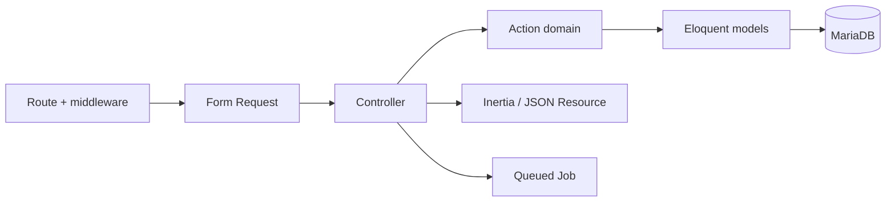

# Backend Sikompen

## Teknologi dan batas tanggung jawab

Backend menggunakan Laravel 13, PHP 8.4, MariaDB, database queue, PhpSpreadsheet untuk XLSX, dan Dompdf untuk PDF. Laravel mengendalikan routing, autentikasi/session, otorisasi, validasi, query, mutasi data, dispatch queue, storage private, dan kontrak JSON/Inertia. React tidak memiliki akses langsung ke database atau file system.

```mermaid
flowchart LR
    R[Route + middleware] --> V[Form Request]
    V --> C[Controller]
    C --> A[Action domain]
    A --> M[Eloquent models]
    M --> DB[(MariaDB)]
    C --> I[Inertia / JSON Resource]
    C --> Q[Queued Job]
```

## Akses dan session

### Standalone

- Guard `admin` menggunakan `KompenResponHubAdmin` pada `sikompen_admins`, bukan tabel `users` bawaan Laravel.
- Login memakai `StoreAdminLoginRequest`, throttle `admin-login`, hashing Laravel, dan regenerasi session setelah berhasil.
- Setup akun pertama tersedia ketika belum ada admin. Admin aktif dapat membuka setup tambahan dengan kode acak yang hanya disimpan sebagai hash dan memiliki masa berlaku.

### Gateway Si-Admin

- `ValidateSiAdminProxyRequest` memverifikasi canonical HMAC request, TTL, nonce/replay, dan role sebelum `SiAdminProxyAccessController` membuat session Sikompen.
- `EnsureSiAdminProxySession` menjaga context session; `EnsureSikompenAdminAccess` melindungi semua route admin.
- Session proxy dapat membatasi mahasiswa ke NIM miliknya pada query/API, bukan hanya pada UI.
- `EnsureSikompenStandalone` memisahkan login/setup lokal dari deployment gateway.

## HTTP layer

| Surface | Akses | Hasil |
| --- | --- | --- |
| `/` | Context akses | Landing/pemilih akses. |
| `/mahasiswa`, `/kompen-respon` | Mahasiswa/proxy session | Tabel read-only. |
| `/admin` | Admin lokal atau proxy admin/superuser | Panel operasional admin. |
| `/admin/login`, `/admin/setup` | Standalone | Login dan setup akun. |
| `/api/kompen-respon/*` | Context akses + limiter | Filter, mahasiswa, mahasiswa tunggal, dan detail sebagai JSON Resource. |

`KompenResponHubTableRequest` menormalisasi filter, memvalidasi input, dan membatasi `per_page` ke 15/25/50/100. `KompenResponHubController` memuat hanya prop yang diperlukan tab aktif untuk menjaga response Inertia tetap ringan.

API memiliki endpoint `filter-options`, `students`, `students/{student}`, dan `details`. API memakai middleware `web`, `sikompen.proxy-session`, serta limiter `sikompen-data`. Input diproses Eloquent/builder dengan parameter binding; bukan SQL yang dibangun dari input pengguna.

## Domain action

| Action | Tanggung jawab |
| --- | --- |
| `ParseKompenResponHubWorkbook` | Membaca template dan menghasilkan payload terstruktur; validasi marker kelas, periode, NIM, detail, serta akumulasi jam. Tidak menulis database. |
| `ValidateKompenResponHubWorkbookArchive` | Memeriksa ZIP/OXML sebelum parsing: ukuran, entry, rasio kompresi, path, required entry, dan formula cell. |
| `ImportKompenResponHubWorkbook` | Menyimpan metadata versi + Log Upload; `replaceActiveData()` dipakai ketika aktivasi. |
| `ActivateKompenResponHubImportVersion` | Memilih satu workbook aktif per periode dan mengganti data live periode tersebut secara transaksional. |
| `KompenResponHubDataQuery` | Sumber query bersama untuk tabel, API, export, List File, Log Upload, SP, riwayat, dan filter. |
| `FinalizeKompenResponHubCutoff` | Mengubah kandidat outstanding menjadi SP `issued` dan mencatat aktivitasnya. |
| `BuildKompenResponHubExport` | Membuat XLSX/PDF landscape dari filter task dan memberi nama file berbasis filter. |
| `RecordKompenResponHubActivity` | Menyimpan actor, subject, context, alasan, before/after, IP, user agent, dan metadata audit. |

## Model dan state utama

| Model/tabel | Fungsi |
| --- | --- |
| `KompenResponHubImport` / `sikompen_imports` | Metadata workbook, filename tampilan, checksum, quality report, dan path private. |
| `KompenResponHubActiveImport` / `sikompen_active_imports` | Pointer satu versi aktif per periode. |
| `KompenResponHubStudent`, `KompenResponHubDetail` | Data live dari versi aktif. |
| `StudentProgress`, `StudentSummaryOverride`, `DetailOverride` | Layer koreksi manual yang membentuk nilai efektif. |
| `PeriodCutoff`, `WarningLetter` | Cutoff, kandidat, finalisasi, resolusi, dan rollback SP. |
| `ImportTask`, `ExportTask` | State machine asynchronous worker. |
| `ImportAuditLog`, `ActivityLog` | Audit lifecycle file dan audit aksi domain. |
| `SystemSetting` | Kebijakan retensi Riwayat Aktivitas. |

Semua model domain mengambil koneksi dari `config('kompen-respon-hub.database_connection')`, tidak mengandalkan database default Laravel.

## Keamanan input dan file

- Semua mutasi memakai Form Request, middleware akses, dan throttle route.
- `SafeSearchTerm` menolak control character/pola input berbahaya pada nama, pencarian, dan alasan.
- XLSX wajib lolos batas upload konfigurasi serta pemeriksaan archive sebelum PhpSpreadsheet memprosesnya.
- File private diunduh melalui controller; filename dinormalisasi agar tidak dapat menginjeksi header.
- Poll/download export membutuhkan access token acak **dan** session ID peminta.
- Mutasi penting direkam dalam Riwayat Aktivitas agar perubahan dapat ditelusuri.

## Aturan perubahan backend

1. Tempatkan validasi pada Form Request, bukan hanya controller.
2. Gunakan `KompenResponHubDataQuery` apabila perilaku harus sama di tabel, API, dan ekspor.
3. Rekam perubahan bisnis melalui `RecordKompenResponHubActivity` dengan subject dan context yang dapat dibaca manusia.
4. Jika route/controller berubah, generate ulang Wayfinder dan perbarui kontrak frontend.
5. Setelah PHP berubah, jalankan Pint, test feature relevan, dan static analysis.

Runtime worker/scheduler dijelaskan dalam [worker-and-scheduler.md](worker-and-scheduler.md); perilaku pengguna ada di [functionality-guide.md](functionality-guide.md).
