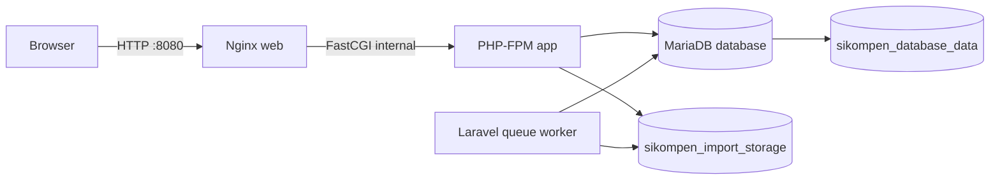
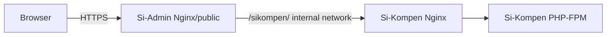

# Deployment guide

## Kondisi deployment saat ini

Repository sudah memiliki Docker Compose single-host dengan empat service:



- Hanya Nginx `web` yang dipublikasikan pada `${APP_PORT}:80`.
- PHP-FPM dan queue tidak mengekspos port ke host.
- MariaDB dipublikasikan hanya pada `127.0.0.1:${KOMPEN_DB_PORT}:3306`, sehingga tidak dapat diakses dari jaringan lain secara langsung.
- XLSX upload berada di named volume `sikompen_import_storage`, mounted di `storage/app/private/kompen-respon-hub/imports` pada service `app` dan `queue`.
- Data database berada pada named volume `sikompen_database_data`.

## Prasyarat host

- Docker Engine dan Docker Compose plugin yang masih didukung.
- DNS dan TLS reverse proxy di depan server bila aplikasi akan diakses publik.
- `.env` produksi yang aman, terutama `APP_KEY` dan password database.
- Backup target terpisah untuk volume database dan volume upload.

## Konfigurasi `.env` minimum

Contoh ini hanya struktur; ganti semua password dan key dengan nilai rahasia yang kuat.

```dotenv
APP_ENV=production
APP_DEBUG=false
APP_URL=https://sikompen.example.ac.id
DOCKER_APP_URL=https://sikompen.example.ac.id
APP_KEY=base64:GENERATE_DENGAN_php_artisan_key_generate

APP_PORT=8080

KOMPEN_RESPON_HUB_DB_CONNECTION=kompen_db
KOMPEN_DB_DATABASE=kompen_database
KOMPEN_DB_USERNAME=kompen_user
KOMPEN_DB_PASSWORD=GANTI_DENGAN_PASSWORD_KUAT
KOMPEN_DB_ROOT_PASSWORD=GANTI_DENGAN_PASSWORD_ROOT_KUAT

SESSION_DRIVER=database
SESSION_CONNECTION=kompen_db
SESSION_TABLE=sikompen_sessions
QUEUE_CONNECTION=database
DB_QUEUE_CONNECTION=kompen_db
DB_QUEUE_RETRY_AFTER=660
```

Di Compose, `KOMPEN_DB_HOST` dan `KOMPEN_DB_PORT` untuk container sudah dioverride menjadi `database:3306`. Jangan arahkan container ke `127.0.0.1`.

## Menjalankan web untuk development

Pilih **satu** cara di bawah. Jangan menjalankan web Docker dan `php artisan serve` pada port yang sama secara bersamaan.

### Pilihan A — seluruh aplikasi dengan Docker Compose

Ini cara paling dekat dengan kondisi production. Cukup satu terminal karena semua service berjalan di background.

Terminal 1:

```bash
docker compose up -d --build
docker compose exec app php artisan migrate
docker compose ps
```

Buka `http://localhost:8080`. Queue worker sudah berjalan sebagai service `queue`; tidak perlu terminal tambahan.

Untuk melihat proses impor atau error sambil memakai web, buka terminal kedua bila diperlukan:

```bash
docker compose logs -f queue web app
```

Hentikan tanpa menghapus database/file upload:

```bash
docker compose down
```

### Pilihan B — MariaDB Docker, Laravel dan React di komputer lokal

Pilihan ini nyaman ketika mengembangkan kode karena Vite memiliki hot reload. Gunakan tiga terminal yang dibiarkan tetap berjalan.

Terminal 1 — nyalakan database saja:

```bash
docker compose up -d database
```

Salin `.env.example` menjadi `.env` bila belum ada, lalu pastikan `KOMPEN_DB_HOST=127.0.0.1`, `KOMPEN_DB_PORT=3307`, dan nilai koneksi lainnya sama dengan database Compose. Setelah dependensi pertama kali terpasang, jalankan migration sekali:

```bash
composer install
npm install
php artisan key:generate
php artisan migrate
```

Terminal 2 — server Laravel:

```bash
php artisan serve
```

Terminal 3 — Vite untuk React/Tailwind:

```bash
npm run dev
```

Terminal 4 — queue worker untuk impor XLSX:

```bash
php artisan queue:work database --sleep=3 --tries=1 --timeout=600
```

Buka `http://127.0.0.1:8000`. Terminal 4 wajib aktif jika akan mencoba fitur upload & impor; halaman tabel dan API tetap dapat dibuka tanpanya.

Tekan `Ctrl+C` pada terminal 2–4 untuk menghentikan proses lokal. Database container dapat dihentikan dengan:

```bash
docker compose stop database
```

### Pilihan C — satu perintah untuk development lokal

Laravel menyediakan runner yang mengumpulkan server aplikasi, Vite, queue, dan log. Jalankan dari satu terminal:

```bash
composer run dev
```

Gunakan opsi ini bila tidak membutuhkan terminal terpisah. Database tetap harus sudah hidup, misalnya melalui `docker compose up -d database` atau MariaDB lokal dengan konfigurasi `.env` yang sesuai.

## First start

```bash
docker compose build
docker compose up -d
docker compose exec app php artisan migrate --force
docker compose exec app php artisan optimize
docker compose ps
```

Kemudian buka `http://localhost:8080` atau domain yang sudah diarahkan ke host. Saat belum ada admin, gunakan `/admin/setup` untuk membuat akun admin pertama.

Perintah `migrate` tidak perlu dijalankan ulang pada setiap restart. Jalankan hanya setelah ada migration baru.

## Update aplikasi

```bash
git pull
docker compose up -d --build app web queue
docker compose exec app php artisan migrate --force
docker compose exec app php artisan optimize
docker compose logs --tail=100 app web queue
```

Jika hanya mengubah UI atau backend, command build di atas sudah membangun asset React dan image PHP yang baru.

## Operasi dan diagnosis

| Kebutuhan | Command |
| --- | --- |
| Status container | `docker compose ps` |
| Log web/PHP/queue | `docker compose logs -f web app queue` |
| Log task impor gagal | `docker compose logs -f queue` lalu cek tab Log upload/admin |
| Shell aplikasi | `docker compose exec app sh` |
| Cek migration | `docker compose exec app php artisan migrate:status` |
| Cek queue gagal | `docker compose exec app php artisan queue:failed` |
| Restart worker | `docker compose restart queue` |
| Rebuild penuh setelah kode berubah | `docker compose up -d --build app web queue` |

## Backup dan restore

Backup harus mencakup **dua** named volume. Database tanpa volume import membuat audit metadata masih ada tetapi XLSX sumber tidak bisa diunduh; volume import tanpa database tidak punya metadata/izin akses.

Sebelum melakukan restore, hentikan service atau setidaknya hentikan `queue` agar tidak ada task impor aktif. Uji prosedur restore di host non-produksi terlebih dahulu.

Untuk mengetahui path volume:

```bash
docker volume inspect sikompen_database_data
docker volume inspect sikompen_import_storage
```

Jangan gunakan `docker compose down -v` di production, karena opsi `-v` menghapus volume beserta database dan file upload.

## Security checklist produksi

- Pasang HTTPS pada reverse proxy publik; set `APP_URL` ke URL `https`.
- Jangan commit `.env`, backup, file XLSX upload, atau password ke repository.
- Ganti seluruh nilai password contoh. Batasi akses SSH dan Docker socket hanya ke operator tepercaya.
- Pertahankan `APP_DEBUG=false`, `server_tokens off`, serta header Nginx yang sudah ada.
- Exposure database tetap localhost saja; jika tidak membutuhkan akses host, hapus mapping port database dari Compose.
- Pantau disk volume; file upload dan audit log akan bertambah seiring waktu.
- Update base image dan dependensi secara berkala, rebuild, lalu jalankan test sebelum deploy.

## Rencana integrasi dengan Si-Admin: belum diimplementasikan

Arsitektur yang telah dibahas untuk fase berikutnya adalah **satu Docker Compose internal**:



Dalam rancangan ini:

- Si-Admin menjadi satu-satunya gateway publik dan memeriksa session/role miliknya sendiri.
- Si-Kompen tidak mempunyai `ports:` publik pada Compose gabungan; hanya dapat dicapai lewat Docker network internal dari Si-Admin.
- Si-Admin meneruskan identitas/role yang telah diverifikasi lewat header internal dan Si-Kompen wajib menolak request yang tidak datang dari gateway tepercaya.
- Jangan berbagi `APP_KEY`, session database, atau cookie antara dua aplikasi.

Compose repository saat ini **belum** mengaktifkan proxy tersebut; ia masih cocok untuk menjalankan Sikompen secara mandiri. Implementasi proxy harus dilakukan bersama tim Si-Admin agar header tepercaya, path prefix, URL asset, TLS, dan error handling memiliki kontrak yang sama.
