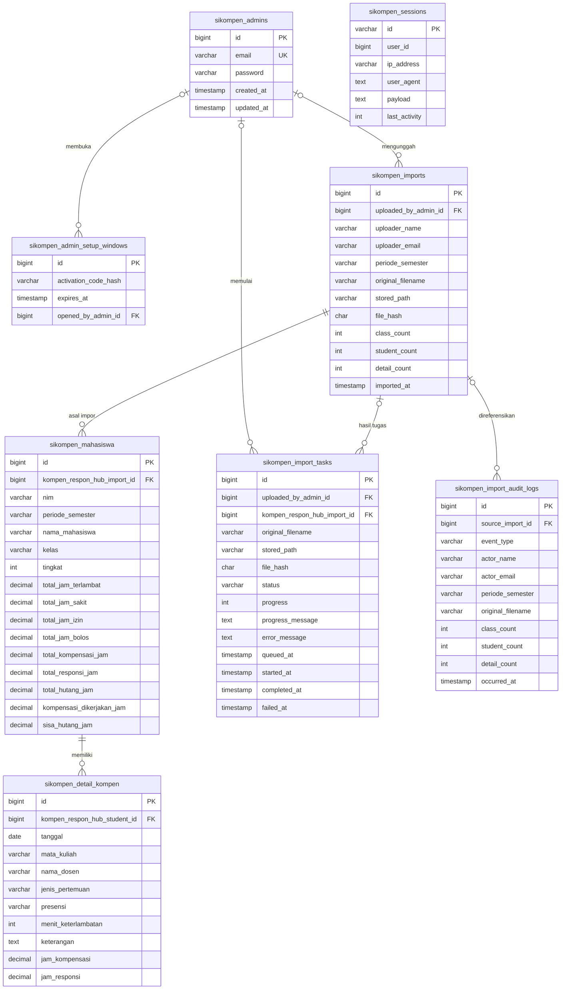

# ERD Sikompen

Seluruh tabel domain Sikompen berada pada koneksi `kompen_db` dan memakai awalan `sikompen_`. Tabel `jobs`, `job_batches`, dan `failed_jobs` adalah infrastruktur Laravel Queue pada koneksi yang sama.

## Relasi dan perilaku penghapusan

- Menghapus satu `sikompen_imports` menghapus mahasiswa asal impor tersebut, lalu seluruh detailnya (`cascade`). Ini yang dipakai oleh rollback unggahan terakhir.
- Admin yang dihapus tidak menghapus data impor. Kolom admin pada impor, tugas, dan jendela setup menjadi `NULL` (`nullOnDelete`).
- Audit log mempertahankan catatan rollback walaupun impor asal sudah dihapus. Karena itu `source_import_id` dapat bernilai `NULL` atau tidak lagi merujuk berkas yang bisa diunduh.
- Berkas XLSX tidak disimpan sebagai BLOB di MariaDB. Metadata dan hash-nya berada pada `sikompen_imports`/`sikompen_import_tasks`; berkas berada di volume Docker `sikompen_import_storage`.

## Index penting

- Mahasiswa unik pada `(nim, periode_semester, kelas)`.
- Index mahasiswa untuk filter dan urutan tabel: periode, tingkat, kelas, nama, dan NIM.
- Detail memiliki index mahasiswa dan index `(tanggal, id)` untuk daftar detail terbaru.
- Impor diurutkan oleh `(imported_at, id)`; audit log oleh `occurred_at`; import task oleh `(status, created_at)`.

Nama PHP masih menggunakan `KompenResponHub…` agar namespace aplikasi stabil, sedangkan nama tabel fisiknya sudah menggunakan `sikompen_…`.
