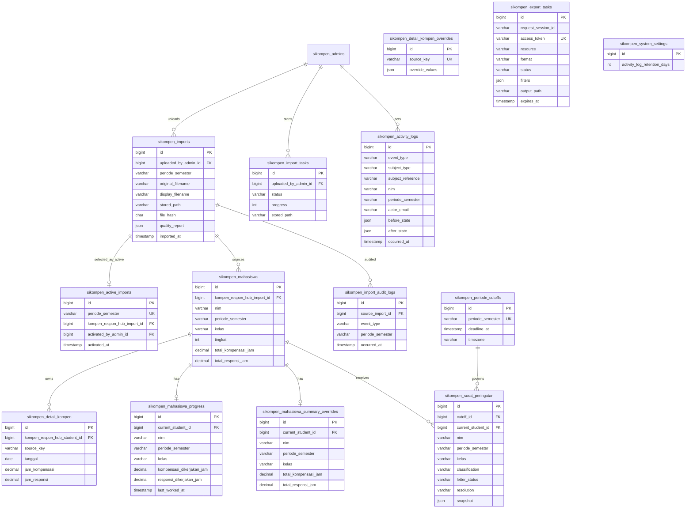

# ERD Sikompen

Seluruh tabel domain memakai koneksi `kompen_db` dan awalan fisik `sikompen_`. Kolom bernama `kompen_respon_hub_*` dipertahankan untuk kompatibilitas namespace/migrasi lama, tetapi tetap mengarah ke entitas Sikompen.

```mermaid
erDiagram
    sikompen_admins ||--o{ sikompen_imports : uploads
    sikompen_admins ||--o{ sikompen_import_tasks : starts
    sikompen_admins ||--o{ sikompen_activity_logs : acts
    sikompen_imports ||--o| sikompen_active_imports : selected_as_active
    sikompen_imports ||--o{ sikompen_mahasiswa : sources
    sikompen_imports ||--o{ sikompen_import_audit_logs : audited
    sikompen_mahasiswa ||--o{ sikompen_detail_kompen : owns
    sikompen_mahasiswa ||--o| sikompen_mahasiswa_progress : has
    sikompen_mahasiswa ||--o| sikompen_mahasiswa_summary_overrides : has
    sikompen_mahasiswa ||--o{ sikompen_surat_peringatan : receives
    sikompen_periode_cutoffs ||--o{ sikompen_surat_peringatan : governs

    sikompen_imports {
        bigint id PK
        bigint uploaded_by_admin_id FK
        varchar periode_semester
        varchar original_filename
        varchar display_filename
        varchar stored_path
        char file_hash
        json quality_report
        timestamp imported_at
    }
    sikompen_active_imports {
        bigint id PK
        varchar periode_semester UK
        bigint kompen_respon_hub_import_id FK
        bigint activated_by_admin_id FK
        timestamp activated_at
    }
    sikompen_mahasiswa {
        bigint id PK
        bigint kompen_respon_hub_import_id FK
        varchar nim
        varchar periode_semester
        varchar kelas
        int tingkat
        decimal total_kompensasi_jam
        decimal total_responsi_jam
    }
    sikompen_detail_kompen {
        bigint id PK
        bigint kompen_respon_hub_student_id FK
        varchar source_key
        date tanggal
        decimal jam_kompensasi
        decimal jam_responsi
    }
    sikompen_mahasiswa_progress {
        bigint id PK
        bigint current_student_id FK
        varchar nim
        varchar periode_semester
        varchar kelas
        decimal kompensasi_dikerjakan_jam
        decimal responsi_dikerjakan_jam
        timestamp last_worked_at
    }
    sikompen_mahasiswa_summary_overrides {
        bigint id PK
        bigint current_student_id FK
        varchar nim
        varchar periode_semester
        varchar kelas
        decimal total_kompensasi_jam
        decimal total_responsi_jam
    }
    sikompen_detail_kompen_overrides {
        bigint id PK
        varchar source_key UK
        json override_values
    }
    sikompen_periode_cutoffs {
        bigint id PK
        varchar periode_semester UK
        timestamp deadline_at
        varchar timezone
    }
    sikompen_surat_peringatan {
        bigint id PK
        bigint cutoff_id FK
        bigint current_student_id FK
        varchar nim
        varchar periode_semester
        varchar kelas
        varchar classification
        varchar letter_status
        varchar resolution
        json snapshot
    }
    sikompen_import_tasks {
        bigint id PK
        bigint uploaded_by_admin_id FK
        varchar status
        int progress
        varchar stored_path
    }
    sikompen_export_tasks {
        bigint id PK
        varchar request_session_id
        varchar access_token UK
        varchar resource
        varchar format
        varchar status
        json filters
        varchar output_path
        timestamp expires_at
    }
    sikompen_import_audit_logs {
        bigint id PK
        bigint source_import_id FK
        varchar event_type
        varchar periode_semester
        timestamp occurred_at
    }
    sikompen_activity_logs {
        bigint id PK
        varchar event_type
        varchar subject_type
        varchar subject_reference
        varchar nim
        varchar periode_semester
        varchar actor_email
        json before_state
        json after_state
        timestamp occurred_at
    }
    sikompen_system_settings {
        bigint id PK
        int activity_log_retention_days
    }
```

## Aturan identitas dan indeks penting

- Satu data mahasiswa efektif unik pada `(nim, periode_semester, kelas)`; identity ini membuat progress, summary override, dan SP dapat dihubungkan ulang ketika versi periode diganti.
- `sikompen_active_imports.periode_semester` unik: tepat satu workbook aktif untuk satu periode.
- SP unik pada `(cutoff_id, current_student_id)`; satu mahasiswa hanya dapat memiliki satu record SP untuk satu cutoff.
- Detail override unik pada `source_key`; override menempel pada detail asal tanpa mengubah snapshot workbook.
- Task export memiliki `access_token` unik dan index session/status untuk polling serta pembersihan.
- Activity log memiliki index periode+waktu, event+waktu, dan identitas mahasiswa untuk audit/pencarian.

## Penyimpanan file

XLSX tidak disimpan di database. `sikompen_imports.stored_path` menunjuk file pada private storage/volume import; `sikompen_export_tasks.output_path` menunjuk hasil export pada volume export. Database hanya menyimpan metadata, checksum/path, status, dan audit.
