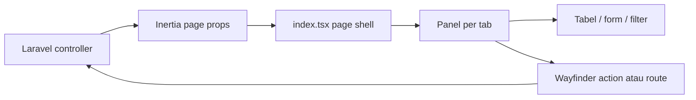

# Arsitektur Frontend Sikompen

## Tujuan

Frontend dipisahkan agar page Inertia tetap tipis, tiap modul mudah diuji/dibaca, dan perubahan pada satu tab tidak berisiko mengubah tab lain. Struktur ini mempertahankan satu entry page karena Laravel mengirim satu kontrak props untuk admin dan mahasiswa, tetapi tidak lagi menaruh seluruh implementasi UI pada satu file. Modul ditempatkan di `resources/js/features/`, bukan di bawah `pages/`, agar resolver Inertia tidak memperlakukan komponen sebagai halaman mandiri.

## Struktur

```text
resources/js/
├── pages/kompen-respon-hub/
│   └── index.tsx                      # Entry Inertia: page shell, state lintas-tab, header, navigasi
└── features/kompen-respon-hub/
    ├── dashboard/
    │   └── dashboard-panel.tsx         # Ringkasan dan profil mahasiswa
    ├── upload/
    │   ├── upload-panel.tsx            # Form upload workbook
    │   ├── upload-progress-panel.tsx   # Progres pengiriman browser
    │   └── import-progress-panel.tsx   # Polling antrean impor
    ├── kompen-respon/
    │   ├── student-table.tsx           # Tabel Kompen dan Respon
    │   ├── edit-mode-control.tsx       # Sakelar mode perbaikan
    │   └── student-correction-panel.tsx # Koreksi total/progres mahasiswa
    ├── detail-kompen/
    │   ├── detail-table.tsx            # Tabel Detail Kompen
    │   └── detail-correction-panel.tsx # Koreksi detail manual
    ├── log-upload/
    │   └── import-audit-log-table.tsx  # Riwayat dan pemulihan versi upload
    ├── surat-peringatan/
    │   └── warning-panel.tsx           # Cutoff, kandidat, dan Surat Peringatan
    ├── riwayat-aktivitas/
    │   └── activity-panel.tsx          # Filter, label, dan tabel aktivitas
    ├── export/
    │   └── export-progress-panel.tsx   # Antrean dan progres ekspor
    └── shared/
        ├── constants.ts                 # Tab berdasarkan peran
        ├── types.ts                     # Kontrak data Laravel/Inertia
        ├── lib/formatters.ts            # Format jam dan tanggal
        └── components/                  # Pagination, filter bersama, feedback, progress
```

## Batas tanggung jawab

- `index.tsx` tidak boleh berisi definisi tabel, form domain, atau polling. Ia hanya merangkai komponen dan mengelola state yang dipakai lintas panel, seperti mode perbaikan serta mahasiswa yang sedang dibuka.
- `shared/types.ts` adalah satu-satunya sumber kontrak frontend domain. Bila payload Laravel berubah, perbarui type ini terlebih dahulu sebelum menyentuh komponen.
- Komponen memakai action/route Wayfinder yang dihasilkan, bukan URL hard-coded. Setelah route atau controller berubah, jalankan `php artisan wayfinder:generate --no-interaction`.
- Folder `upload/` dan `export/` mempertahankan polling progres hanya ketika task aktif. Ekspor diproses berurutan oleh backend queue; UI hanya membaca statusnya.
- Folder tiap tab menangani presentasi dan form untuk domainnya sendiri. Tabel tidak memuat data sendiri sehingga tetap deterministik dari props Inertia.

## Alur data



## Checklist perubahan frontend

1. Tambahkan atau sesuaikan kontrak di `shared/types.ts`.
2. Pilih folder tab yang tepat; buat file baru bila tanggung jawabnya berbeda, bukan menambah blok besar ke `index.tsx` atau folder tab lain.
3. Gunakan komponen UI bersama dari `resources/js/components/ui/`.
4. Gunakan Wayfinder untuk navigasi dan form.
5. Jalankan `npm run build`; bila route/controller ikut berubah, generate Wayfinder dan jalankan test Laravel terkait.
