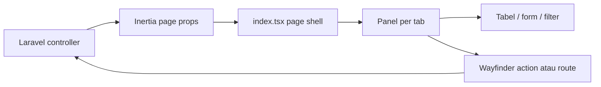

# Arsitektur Frontend Sikompen

## Tujuan

Frontend dipisahkan agar page Inertia tetap tipis, tiap modul mudah diuji/dibaca, dan perubahan pada satu tab tidak berisiko mengubah tab lain. Struktur ini mempertahankan satu entry page karena Laravel mengirim satu kontrak props untuk admin dan mahasiswa, tetapi tidak lagi menaruh seluruh implementasi UI pada satu file.

## Struktur

```text
resources/js/pages/kompen-respon-hub/
├── index.tsx                 # Page shell, state lintas-tab, header, navigasi
├── types.ts                  # Kontrak data dari Laravel/Inertia
├── constants.ts              # Tab berdasarkan peran
├── lib/
│   └── formatters.ts         # Format jam dan tanggal
└── components/
    ├── activity.tsx          # Riwayat aktivitas
    ├── dashboard.tsx         # Dashboard dan profil mahasiswa
    ├── feedback.tsx          # Panduan tabel dan empty state
    ├── records.tsx           # Filter serta koreksi data Kompen/Detail
    ├── tables.tsx            # Tabel dan pagination
    ├── tasks.tsx             # Polling/progress task dan antrean ekspor
    ├── upload-panel.tsx      # Upload workbook
    └── warnings.tsx          # Cutoff dan Surat Peringatan
```

## Batas tanggung jawab

- `index.tsx` tidak boleh berisi definisi tabel, form domain, atau polling. Ia hanya merangkai komponen dan mengelola state yang dipakai lintas panel, seperti mode perbaikan serta mahasiswa yang sedang dibuka.
- `types.ts` adalah satu-satunya sumber kontrak frontend domain. Bila payload Laravel berubah, perbarui type ini terlebih dahulu sebelum menyentuh komponen.
- Komponen memakai action/route Wayfinder yang dihasilkan, bukan URL hard-coded. Setelah route atau controller berubah, jalankan `php artisan wayfinder:generate --no-interaction`.
- `tasks.tsx` mempertahankan polling progres hanya ketika task aktif. Ekspor diproses berurutan oleh backend queue; UI hanya membaca statusnya.
- `tables.tsx` menangani presentasi serta pagination. Ia tidak memuat data sendiri sehingga tetap deterministik dari props Inertia.

## Alur data



## Checklist perubahan frontend

1. Tambahkan atau sesuaikan kontrak di `types.ts`.
2. Pilih modul domain yang tepat; buat file baru bila tanggung jawabnya berbeda, bukan menambah blok besar ke `index.tsx`.
3. Gunakan komponen UI bersama dari `resources/js/components/ui/`.
4. Gunakan Wayfinder untuk navigasi dan form.
5. Jalankan `npm run build`; bila route/controller ikut berubah, generate Wayfinder dan jalankan test Laravel terkait.
