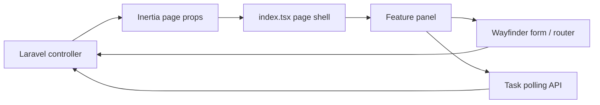

# Arsitektur Frontend Sikompen

## Tujuan

Frontend dipisahkan per feature supaya `pages/kompen-respon-hub/index.tsx` tetap menjadi page shell yang kecil dan tiap tab dapat berubah tanpa memengaruhi tab lain. Laravel mengirim satu kontrak page props untuk admin/mahasiswa, tetapi implementasi visual/domain tidak dikumpulkan pada satu file.

```text
resources/js/
├── app.tsx
├── pages/
│   ├── welcome.tsx
│   ├── auth/                         # login dan setup
│   ├── admin/settings.tsx
│   └── kompen-respon-hub/index.tsx   # Inertia entry / page shell
├── features/kompen-respon-hub/
│   ├── dashboard/                    # global search dan profil mahasiswa
│   ├── upload/                       # upload/progress import
│   ├── kompen-respon/                # ringkasan + koreksi
│   ├── detail-kompen/                # detail + koreksi
│   ├── list-file/                    # versi aktif/rename/delete
│   ├── log-upload/                   # audit lifecycle workbook
│   ├── surat-peringatan/             # cutoff, kandidat, SP
│   ├── riwayat-aktivitas/            # audit dan retensi
│   ├── export/                       # task export
│   └── shared/                       # type, constant, formatter, component lintas feature
├── components/ui/                    # primitive UI global
├── actions/                          # generated Wayfinder actions
└── routes/                           # generated Wayfinder routes
```

## Batas tanggung jawab

- `index.tsx` menyusun header, tab, state lintas panel, panel yang dipilih, dan page props. Tidak ada definisi tabel bisnis atau form besar di sini.
- Feature panel menangani presentasi dan interaksi domennya sendiri; data tetap berasal dari props Inertia atau endpoint spesifik seperti global student search/task polling.
- `shared/types.ts` merupakan sumber kontrak frontend domain. Perubahan Resource Laravel harus dimulai dari type ini.
- `shared/components/` hanya menampung primitive domain lintas feature (filter, pager, empty state, progress), bukan komponen satu tab.
- `components/ui/` adalah primitive visual global. Ubah di sana hanya bila seluruh aplikasi memang harus berubah.
- `actions/` dan `routes/` adalah code generated Wayfinder; jangan diedit manual.

## Alur data



Task polling digunakan hanya untuk import/export yang aktif. Perpindahan tab tidak menghentikan worker backend maupun kehilangan state task dari page props berikutnya.

## Aturan pengembangan

1. Letakkan feature baru di folder domain terdekat.
2. Ubah type domain sebelum JSX yang memakai payload baru.
3. Gunakan Wayfinder dan `router` Inertia, bukan URL string manual.
4. Pertahankan `isAdmin` untuk UI, tetapi selalu tambah middleware/authorization backend untuk akses baru.
5. Setelah route/controller berubah, generate Wayfinder. Setelah UI berubah, jalankan typecheck dan production build.

Lihat [frontend-files-explained.md](frontend-files-explained.md) untuk daftar file dan [frontend-guide.md](frontend-guide.md) untuk prosedur perubahan UI.
