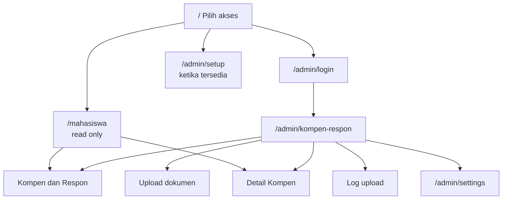

# Frontend Sikompen

Frontend memakai React 19 + TypeScript yang dirender melalui Inertia v3. Laravel tetap mengendalikan URL, validasi, authorization, dan data awal; React menerima props halaman lalu membuat interaksi tanpa API client terpisah.

## Halaman dan akses

Halaman mahasiswa dan admin berbagi `resources/js/pages/kompen-respon-hub/index.tsx`. Prop `isAdmin` menentukan tab serta aksi yang diizinkan:

- Mahasiswa hanya melihat Kompen dan Respon/Detail Kompen serta tombol ekspor.
- Admin mendapat tab Upload dan Log upload, template download, progress impor, rollback unggahan terakhir, serta tautan Pengaturan.

## Navigasi dan data

- Semua navigasi tabel/filter memakai Link Inertia sehingga URL tetap mencerminkan filter aktif.
- Wayfinder menghasilkan fungsi route bertipe TypeScript pada `resources/js/actions/` dan `resources/js/routes/`. Komponen memakainya, bukan menulis URL hard-coded.
- Page props dari Laravel telah memuat paginator untuk tab yang aktif dan opsi filter. API tetap tersedia untuk integrasi luar dan untuk tautan data lengkap per mahasiswa.
- Nilai jam diformat dengan `Intl.NumberFormat('id-ID')`; angka tabel memakai `tabular-nums` agar kolom rata dan mudah dipindai.

## Upload dan progress

Komponen upload memakai Inertia `Form` dengan file input asli. Ia mencegah drop file ke input nama pengunggah, menampilkan progres pengiriman file, lalu setelah request sukses melakukan polling endpoint task aktif. Karena polling tidak bergantung pada tab aktif, status pemrosesan tetap terbarui saat admin melihat tabel lain.

## UI system

- Styling menggunakan Tailwind CSS 4.
- Komponen dasar (`Button`, `Card`, `Input`, `Select`, `Alert`, dan lain-lain) berada di `resources/js/components/ui/` dan dibangun di atas Radix UI/CVA.
- Ikon memakai `lucide-react`.
- `Sonner` menangani toast global; `TooltipProvider` diberikan pada root aplikasi.
- Warna, radius, dan light/dark token didefinisikan sebagai CSS variables dalam `resources/css/app.css`.

## Halaman autentikasi

- `welcome.tsx` memperlihatkan pilihan akses, bukan langsung memaksa login.
- `auth/admin-login.tsx` menyediakan login email/password dan tombol mata untuk menampilkan password.
- `auth/admin-setup.tsx` membuat akun admin pertama atau akun tambahan dengan kode aktivasi.
- `admin/settings.tsx` membuka/menutup pendaftaran admin dan hanya menampilkan kode aktivasi sekali melalui flash session.

Tidak ada state otentikasi sensitif di localStorage. Akses admin ditentukan oleh session cookie Laravel pada server.
