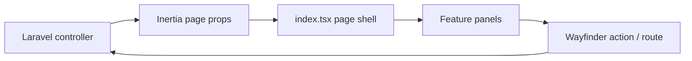

# Frontend Sikompen

## Teknologi dan prinsip

Frontend memakai React 19 + TypeScript melalui Inertia v3. Laravel tetap memiliki URL dan semua keputusan keamanan; React menerima props, mengirim navigasi/form melalui Inertia dan Wayfinder, lalu merender ulang berdasarkan response server.

Tidak ada token autentikasi atau data administratif sensitif di `localStorage`. Session cookie server adalah sumber akses. `isAdmin` mengatur UI, sedangkan middleware backend tetap menjadi otorisasi sebenarnya.


```mermaid
flowchart LR
    L[Laravel controller] --> P[Inertia page props]
    P --> I[index.tsx page shell]
    I --> F[Feature panels]
    F --> W[Wayfinder action / route]
    W --> L
```

## Entry point dan shell

- `resources/js/app.tsx`: membuat aplikasi Inertia, progress navigation, tooltip provider, dan Sonner toast.
- `resources/js/pages/kompen-respon-hub/index.tsx`: entry page admin/mahasiswa; merangkai header, global search, notifikasi, tab, dan feature panel.
- `welcome`, `auth/admin-login`, `auth/admin-setup`, serta `admin/settings` adalah halaman mandiri karena memiliki lifecycle URL sendiri.

`index.tsx` tidak seharusnya memuat implementasi tabel atau form domain yang besar. Implementasi dipisah feature-first di `resources/js/features/kompen-respon-hub/`.

## Tab dan data

Admin memiliki tab Upload Dokumen, Kompen dan Respon, Detail Kompen, List File, Log Upload, Surat Peringatan, serta Riwayat Aktivitas. Mahasiswa hanya mendapatkan Kompen dan Respon dan Detail Kompen dalam read-only mode.

- Query URL menyimpan tab, filter, page, dan jumlah baris. URL dapat dibagikan atau direload tanpa state tersembunyi.
- Paginator mendukung 15/25/50/100 baris, nomor halaman, serta arrow sebelumnya/berikutnya.
- `shared/types.ts` adalah kontrak TypeScript untuk props Inertia dan JSON Resource.
- Action dan route berasal dari Wayfinder (`resources/js/actions/`, `resources/js/routes/`), bukan URL hard-coded.

## Struktur feature-first

```text
resources/js/features/kompen-respon-hub/
├── dashboard/          # profil mahasiswa dari global search dan history ringkas
├── upload/             # upload browser + polling import task
├── kompen-respon/      # tabel ringkasan, mode perbaikan, progress/override
├── detail-kompen/      # tabel detail dan override
├── list-file/          # versi workbook; aktivasi/rename/delete
├── log-upload/         # filter dan tabel lifecycle workbook
├── surat-peringatan/   # cutoff, kandidat, finalisasi, SP, dan riwayat
├── riwayat-aktivitas/  # filter, tabel aktivitas, kebijakan retensi
├── export/             # request, polling, cancel/dismiss/download task
└── shared/             # types, constants, formatters, pager/filter/feedback/progress
```

UI atom seperti `Button`, `Select`, `Input`, `Dialog`, dan `Card` tetap ada di `resources/js/components/ui/`. Komponen shared domain hanya digunakan jika benar-benar lintas feature.

## Perilaku UI penting

### Worker progress

Upload memisahkan progres upload browser dan progres import worker. `ImportProgressPanel` tetap polling ketika admin berpindah tab. Ekspor juga memakai task asynchronous melalui `ExportProgressPanel`, dengan state queued, processing, completed, failed, atau cancelled. Notifikasi task terminal dapat ditutup.

### Filter dan tabel

`FilterPanel` ditempatkan dalam card yang sama dengan tabel terkait. Surat Peringatan membedakan periode SP dikelola dan periode list mahasiswa, agar membaca histori tidak menyebabkan finalisasi pada periode yang salah. Empty state admin menyarankan langkah berikutnya; empty state mahasiswa hanya menjelaskan ketiadaan data.

### Koreksi

Mode perbaikan diaktifkan dahulu. Form muncul sebagai panel buka/tutup, bukan sederet tombol edit pada setiap cell. Dengan ini tabel mudah dipindai dan perubahan memiliki konteks yang jelas.

### Akses mahasiswa

Mahasiswa hanya melihat data dan ekspor sesuai scope; tombolnya adalah **Keluar** ke landing. Pada proxy mode, pembatasan NIM diberikan server-side sehingga mengubah URL browser tidak memperluas data.

## Visual system

- Tailwind CSS 4; token utama berada pada `resources/css/app.css`.
- Palette utama: `#F0F3FA`, `#D5DEEF`, `#B1C9EF`, `#8AAEE0`, `#628ECB`, `#395886`.
- Tombol biru gelap memakai teks/ikon putih agar kontras konsisten.
- Select/dropdown memakai latar putih dan icon arrow seragam.
- Filter/action dapat wrap di mobile tanpa menyembunyikan informasi penting.

## Checklist perubahan frontend

1. Cari folder feature yang paling dekat dengan kebutuhan sebelum membuat komponen baru.
2. Ubah type di `shared/types.ts` ketika payload Laravel berubah.
3. Gunakan Wayfinder untuk link/form/request.
4. Gunakan komponen UI yang sudah tersedia agar aksesibilitas dan gaya konsisten.
5. Jika route/controller berubah, jalankan `php artisan wayfinder:generate --with-form --no-interaction`.
6. Jalankan `npm run check` serta `npm run build` sebelum deployment.

Peta file lengkap tersedia pada [frontend-files-explained.md](frontend-files-explained.md); perilaku operator pada [functionality-guide.md](functionality-guide.md).
