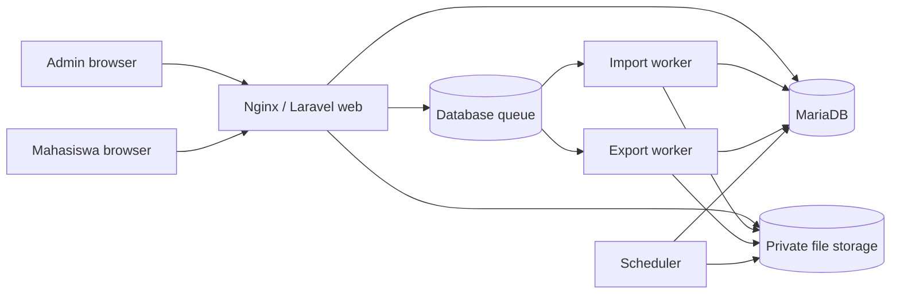
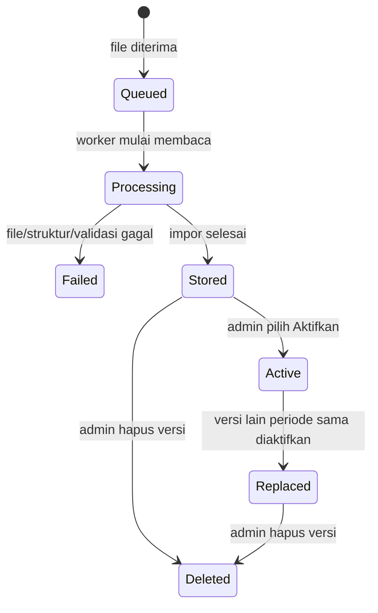
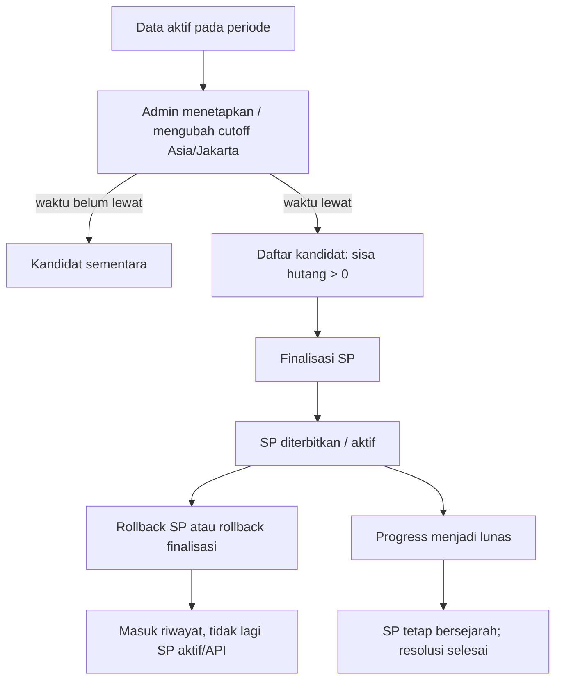

# Arsitektur dan Logika Sistem

## Batas sistem

Sikompen adalah aplikasi Laravel + Inertia React untuk mengelola sumber data Kompen/Responsi dalam workbook XLSX, mengaktifkan satu versi data per periode, mencatat progres/koreksi, dan menerbitkan Surat Peringatan (SP) setelah cutoff. File XLSX dan hasil ekspor tidak disimpan sebagai BLOB database: metadata dan audit ada di MariaDB, sedangkan berkas berada pada storage private Laravel.



Dalam deployment gateway, Si-Admin membuat sesi akses Sikompen melalui request HMAC internal. Dalam mode standalone, admin memakai guard session Laravel. Detail kontrak proxy tetap berada di [si-admin-proxy-contract.md](si-admin-proxy-contract.md).

## Data aktif dan versi workbook

Satu upload selalu menjadi **versi baru**, bukan langsung data live. Ini menghindari file yang salah mengubah tabel secara tidak sengaja.



Aturan utama:

1. Parser memvalidasi template, periode, NIM, kelas, hubungan detail–mahasiswa, dan kecocokan total jam sebelum data versi disimpan.
2. `sikompen_imports` menyimpan metadata versi dan path XLSX; `sikompen_active_imports` menyimpan tepat satu pilihan aktif untuk setiap `periode_semester`.
3. Saat aktivasi, data mahasiswa dan detail **hanya untuk periode versi tersebut** diganti dari workbook yang dipilih. Progress, override ringkasan, dan riwayat SP yang identitasnya sama (`NIM + periode + kelas`) dihubungkan kembali ke baris mahasiswa yang baru.
4. Mengaktifkan versi baru pada periode yang sama otomatis menggantikan pilihan aktif sebelumnya. Periode lain tidak terganggu.
5. Log Upload mencatat upload, aktivasi, penggantian/restore, rename, dan delete. Riwayat Aktivitas mencatat dampak operasionalnya juga.

## Alur impor dan aktivasi

```mermaid
sequenceDiagram
    participant A as Admin
    participant Web as Laravel web
    participant Q as Database queue
    participant W as Import worker
    participant FS as Private storage
    participant DB as MariaDB

    A->>Web: Upload XLSX + nama pengunggah
    Web->>FS: simpan file private
    Web->>DB: buat import task (queued)
    Web->>Q: dispatch ProcessImport
    W->>FS: validasi ZIP/XML dan baca workbook
    W->>W: validasi template, data, total jam
    alt valid
        W->>DB: simpan metadata versi + Log Upload
        W->>DB: task completed; versi menunggu aktivasi
        A->>Web: pilih versi di List File
        Web->>DB: ganti data aktif periode secara transaksional
    else tidak valid
        W->>DB: task failed + alasan
        W->>FS: hapus file task gagal
    end
```

## Hutang efektif, koreksi, dan progres

Nilai pada tabel dibaca sebagai nilai efektif, bukan sekadar nilai asal workbook.

```text
total efektif = override ringkasan jika ada; jika tidak, total dari workbook
jam dikerjakan = progress manual jika ada; jika tidak, 0
sisa hutang = max(0, total kompen + total responsi - dikerjakan kompen - dikerjakan responsi)
```

- Koreksi ringkasan tidak boleh membuat total hutang lebih kecil daripada jam yang sudah dikerjakan.
- Progress dengan jam dikerjakan lebih dari nol wajib menyertakan waktu terakhir dikerjakan.
- Koreksi Detail Kompen disimpan sebagai override berbasis `source_key`, sehingga data asal workbook tetap dapat diaudit.
- Pembaruan progress atau total akan menyelaraskan status penyelesaian SP yang terkait dan mencatat before/after state pada riwayat aktivitas.

## Cutoff dan Surat Peringatan



- Cutoff ditulis dan divalidasi dalam zona waktu `Asia/Jakarta`; input minimal lima menit dari waktu Jakarta saat ini.
- Satu periode dapat dipilih sebagai **Periode SP dikelola**. Daftar mahasiswa dapat diperiksa dengan periode tampilan yang berbeda tanpa mengubah periode yang akan difinalisasi.
- Setelah cutoff terlewati, mahasiswa dengan sisa jam menjadi kandidat. Tombol **Finalisasi SP** menerbitkan SP untuk kandidat yang masih memiliki sisa jam.
- SP yang di-rollback tetap tampil di riwayat surat sebagai audit, tetapi bukan SP aktif dan tidak boleh menjadi data integrasi/API SP.
- Finalisasi bukan penguncian data: cutoff, data aktif, progres, dan koreksi masih bisa diperbaiki. Setiap perbaikan diselaraskan dan dicatat.

## Ekspor dan audit

Ekspor adalah request yang diproses asynchronous. Browser menerima task, panel mem-poll status task, dan file baru dapat diunduh ketika berstatus `completed`. Semua task ekspor memakai token acak + session ID peminta; task tidak dapat dibaca/didownload hanya dengan menebak ID.

Nama hasil ekspor mengikuti resource dan filter efektif, misalnya:

```text
kompen-dan-respon--periode-2026-2027-genap--kelas-1aea1--ekspor-42.xlsx
```

XLSX mengikuti batas `SIKOMPEN_EXPORT_MAX_ROWS` (default 5.000) untuk melindungi memori worker. PDF landscape tidak memakai batas jumlah baris aplikasi, tetapi tetap bergantung pada kapasitas worker/server. Task dapat dibatalkan sebelum selesai dan task gagal/stale memberi pesan yang dapat ditindaklanjuti.

## Retensi

- Hasil dan task ekspor dibersihkan setelah `SIKOMPEN_EXPORT_RETENTION_HOURS` (default 24 jam).
- Task impor terminal dibersihkan setelah `SIKOMPEN_IMPORT_TASK_RETENTION_DAYS` (default 30 hari).
- Riwayat aktivitas dibersihkan berdasarkan kebijakan yang dapat diatur admin, default 365 hari.
- Metadata impor, versi workbook, Log Upload, data aktif, dan riwayat SP tidak dihapus otomatis oleh tiga kebijakan di atas.
